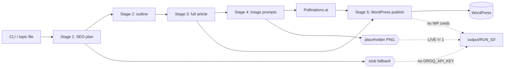

# content-genie

> End-to-end blog post pipeline: topic → SEO plan → outline → full article → AI images → WordPress publish. All free tiers, offline-first demo.


## What it does

Takes a topic string and produces a publish-ready blog post: SEO plan (title, slug, meta, focus keyword, audience), an H2-level outline, a full 1500–2000-word markdown article, three matching images, and an optional WordPress publish step. Originally built to replace a fragile n8n flow that depended on a paid OpenAI key — this version uses only free tiers (Groq for text, Pollinations for images, WordPress REST for publish).

The full pipeline runs **offline** with deterministic stubs whenever `GROQ_API_KEY` is unset, so reviewers can `make demo` and inspect real plan/outline/article/image artifacts without signing up for anything.

## Quickstart

```bash
git clone https://github.com/gokhanagarer/content-genie.git
cd content-genie
make demo
```

You'll see a new run directory under `output/`:

```
output/20260516_113000/
├── plan.json          # SEO plan
├── outline.json       # H2 outline
├── article.md         # full markdown article
├── hero.png           # cinematic hero image
├── info.png           # infographic
└── photo.png          # lifestyle photo
```

## Going live

```bash
cp .env.example .env
# fill in GROQ_API_KEY for real article generation
# set LIVE=1 to actually fetch images from Pollinations
# fill in WP_* if you want WordPress publishing

make install
.venv/bin/python -m src.main --topic "Your topic here"           # local only
.venv/bin/python -m src.main --topic "Your topic here" --publish # publishes live
```

You can also feed it a list of topics:

```bash
.venv/bin/python -m src.main --from-keywords examples/topics.txt --no-wp
```

## Architecture



## Configuration

| Env var | When required | Purpose |
|---|---|---|
| `GROQ_API_KEY` | live LLM output | [Groq console](https://console.groq.com) — free, llama-3.3-70b |
| `GROQ_MODEL` | optional | default `llama-3.3-70b-versatile` |
| `LIVE` | live images | `1` calls Pollinations.ai, `0` writes placeholder PNGs |
| `WP_SITE_URL` | publishing | base URL of WordPress site |
| `WP_USER` | publishing | WP user (must have publish permission) |
| `WP_APP_PASSWORD` | publishing | WP [application password](https://wordpress.com/support/security/two-step-authentication/application-specific-passwords/) — never use the user's login password |
| `CONTENT_LANGUAGE` | optional | default `English` |
| `TARGET_WORD_COUNT` | optional | default `1800` |

## Project layout

```
.
├── src/
│   ├── plan.py        # Stage 1–4 LLM calls (with stub fallback)
│   ├── stubs.py       # deterministic offline outputs for plan/outline/article/prompts
│   ├── images.py      # Pollinations adapter + placeholder PNG fallback
│   ├── publish.py     # WordPress REST adapter
│   ├── main.py        # CLI + orchestrator
│   └── demo.py        # `make demo` entrypoint
├── examples/topics.txt
├── tests/
├── .env.example
├── Makefile
└── README.md
```

## Tests

```bash
make test
```

Tests exercise the offline pipeline end-to-end and validate plan / outline / article shapes. No network access required.

## License

MIT — see [LICENSE](LICENSE).
