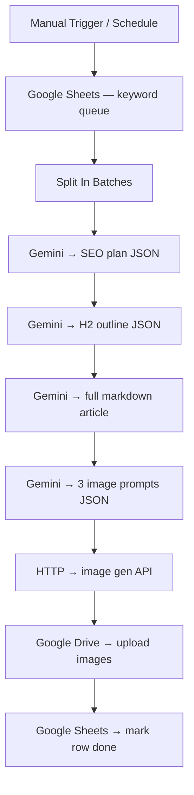

# n8n workflow — Content Genie

A 69-node n8n workflow that mirrors the Python pipeline (`src/main.py`) but runs inside n8n. Useful if you already operate n8n and want the same logic alongside your other automations without maintaining Python code.

The Python script is the canonical reference. This workflow is a teaching example.

---

## What it does



The workflow expects a Google Sheet acting as the work queue: one row per topic to generate, with a `status` column that flips from `pending` to `done` after the run.

---

## How to import

1. Open n8n → **Workflows** → top-right `+` → **Import from file**
2. Pick `n8n/content-pipeline.json`
3. Re-bind credentials (every external node will show ⚠️)

You'll see these placeholders to replace:

| Placeholder              | Where it appears                       | What to fill in                            |
|--------------------------|----------------------------------------|--------------------------------------------|
| `YOUR_GOOGLE_SHEET_ID`   | Sheet read + sheet write nodes         | Your keyword queue spreadsheet ID          |
| `YOUR_GOOGLE_DRIVE_FOLDER_ID` | Drive upload nodes                | Where generated images should be stored    |
| `YOUR_CREDENTIAL_ID`     | All Google + Gemini credential refs    | Re-select from dropdown after creating     |

---

## Set up the Google Sheet

Create a sheet with this structure:

| Topic                | Language | Status  | Plan | Article URL | Hero Image | Notes |
|----------------------|----------|---------|------|-------------|------------|-------|
| Server-Side Tagging  | English  | pending |      |             |            |       |
| Event Taxonomy       | English  | pending |      |             |            |       |

- The workflow reads rows where `Status == pending`
- After a successful run it writes `Plan`, `Article URL`, `Hero Image`, sets `Status = done`
- Errors bubble back to a `Notes` cell so you can see what failed without opening the n8n executions tab

---

## Credentials to connect

| Node type           | Credential               | Where to get it                                                  |
|---------------------|--------------------------|------------------------------------------------------------------|
| `googleGemini`      | Google AI Studio API key | https://aistudio.google.com/app/apikey                           |
| `googleSheets`      | Google OAuth2            | https://console.cloud.google.com → enable Sheets API             |
| `googleDrive`       | Google OAuth2 (same project) | Add Drive scope on the same OAuth credential                 |
| `httpRequest`       | (none for Pollinations)  | n8n calls `image.pollinations.ai` without auth                   |

If you want the Gemini node to handle image generation directly instead of the HTTP node, switch it to model `gemini-2.5-flash-image` and remove the HTTP path. Both topologies are present in the workflow as alternative branches.

---

## Running it

- **Test a single topic**: click the `Manual Trigger` node → **Execute Node**. Watch the row in your sheet flip to `done` after ~30 s.
- **Run for the whole sheet**: top-right → **Execute Workflow**. Topics are processed sequentially via `Split In Batches`.
- **Schedule**: swap `Manual Trigger` for `Schedule Trigger`, then activate the workflow.

---

## Notable nodes

1. **`Split In Batches`** — processes one row at a time so a single failing topic doesn't roll back the whole batch
2. **`Gemini — Generate Plan`** — wraps the LLM call with `temperature: 0.4` for stable JSON output
3. **`Code — Parse JSON`** — strips Markdown fences (Gemini sometimes wraps replies in ` ```json `) before downstream nodes parse the response
4. **`If — Article quality check`** — short-circuits if the article is under 500 words; flags the row for manual review
5. **`Google Drive — Upload Hero`** — uploads as PNG with a slug-based filename so downstream WordPress publishing knows where to find it

---

## Cost notes

- **Gemini free tier** — 15 req/min, fine for ≤ 10 topics/day. The 4 generation steps × 10 topics = 40 req/day, well under quota.
- **Google Sheets / Drive** — free for personal Google accounts.
- **Pollinations.ai** — free, no key required.

Total cost for a daily run of 10 topics: **€0**.

---

## When to use the n8n version vs Python

| Choose **n8n** when                                            | Choose the Python script when                              |
|----------------------------------------------------------------|-------------------------------------------------------------|
| You already run n8n and want everything visualised             | You don't want to operate n8n                              |
| Non-developers (content team) will tune the prompts             | The pipeline lives inside another codebase                  |
| You want to wire it to other n8n automations (Slack, CRM…)      | You're integrating into CI/CD                              |
| You want execution history out of the box                       | Cost matters — Python on cron is free, n8n cloud is metered |
